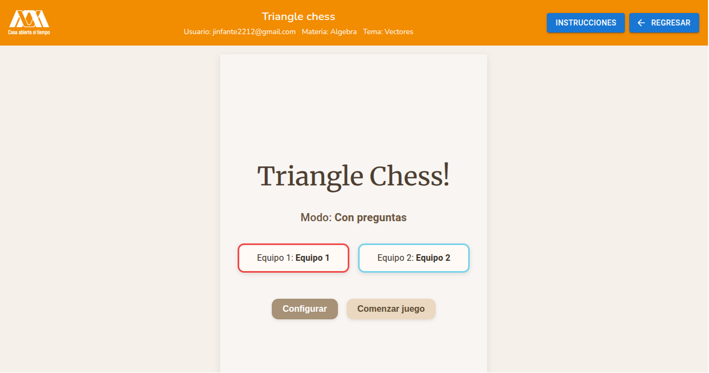
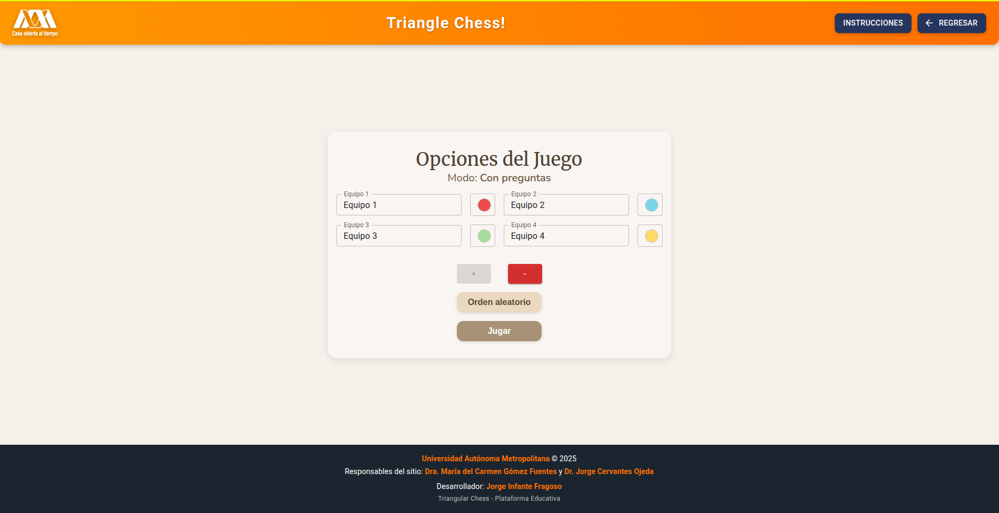
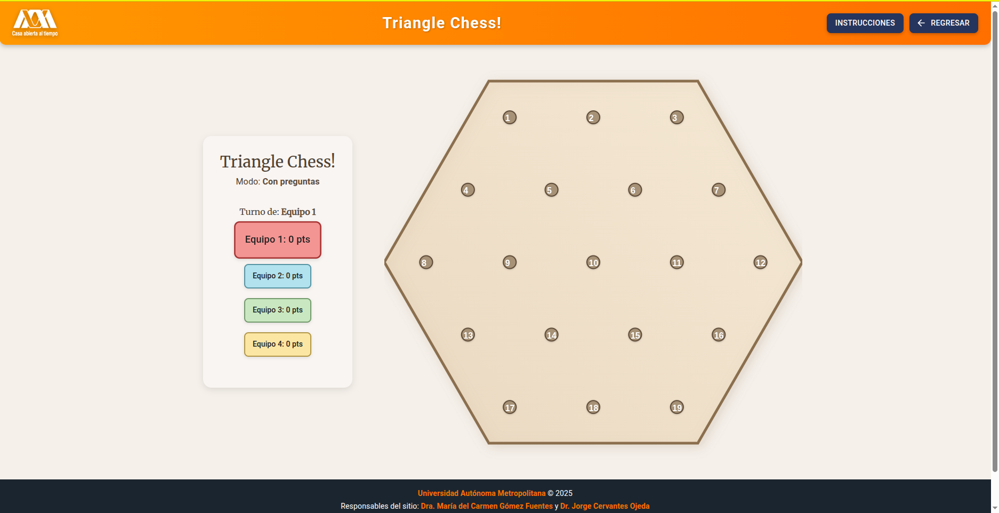

# ♟️ Triangular Chess


> **Triangular Chess** es un videojuego educativo multijugador, desarrollado en React, que combina estrategia y aprendizaje mediante preguntas integradas desde la plataforma VAEP-UAM. El juego utiliza React Konva para el renderizado interactivo del tablero, Material UI para la interfaz, y Firebase para autenticación y gestión de datos.

## 📌 Características principales

- 🔺 Tablero hexagonal con vértices y conexiones creadas dinámicamente en HTML5 Canvas usando React Konva.
- 📚 Modo de juego con preguntas (o sin ellas) para apoyar el aprendizaje en distintas materias.
- 🧠 Cada movimiento correcto permite responder una pregunta para seguir avanzando.
- 🧑‍🏫 Integración con la plataforma VAEP de la UAM para lanzar el juego con parámetros personalizados.
- 🎨 Interfaz moderna con MUI y estilos modulares.
- 🔒 Autenticación e identificación de usuarios mediante tokens.

---

## 🧩 Tecnologías utilizadas


Además, se utilizan las siguientes tecnologías y herramientas:

- [React](https://react.dev/) — Framework principal para la UI.
- [React Router DOM](https://reactrouter.com/) — Navegación entre páginas.
- [Material UI (MUI)](https://mui.com/) — Componentes de interfaz modernos y accesibles.
- [React Konva](https://konvajs.org/docs/react/) — Renderizado de gráficos en Canvas para el tablero.
- [Firebase](https://firebase.google.com/) — Autenticación, base de datos y hosting.
- [Vite](https://vitejs.dev/) — Bundler y servidor de desarrollo ultrarrápido.
- [CSS Modules](https://github.com/css-modules/css-modules) — Estilos encapsulados por componente.
- [Jest](https://jestjs.io/) y [React Testing Library](https://testing-library.com/docs/react-testing-library/intro/) — Pruebas unitarias y de integración.
- [ESLint](https://eslint.org/) y [Prettier](https://prettier.io/) — Linting y formateo automático de código.

---

## 📂 Estructura del proyecto

El proyecto está organizado en módulos según responsabilidad (componentes, páginas, estilos, servicios, etc.), destacando:

- `game/components/board/`: componentes visuales del tablero (hexágonos, vértices, conexiones).
- `game/hooks/`: hooks personalizados para lógica de juego, preguntas, selección, etc.
- `game/services/`: lógica de movimiento y reglas del juego.
- `game/pages/`: vistas del flujo del juego (inicio, en juego, finalización).
- `firebase/`: configuración de conexión con Firebase.
- `contexts/`: contexto global del juego.

---

## 🧪 Cómo ejecutar el proyecto

1. Clona el repositorio:
    ```bash
    git clone https://github.com/tuusuario/triangular-chess.git
    cd triangular-chess
    ```
2. Instala las dependencias:

    ```bash
    npm install
    ```

3. Configura Firebase:

    Crea un archivo `.env` con tus credenciales o edita `firebaseConfiguration.js` y `firebaseVAEP.js` con los valores de tu proyecto Firebase.

4. Ejecuta el proyecto:

   ```bash
   npm start
   ```

5. Accede a: [http://localhost:5173](http://localhost:5173)

---

## 🖼️ Anexo: Evidencia visual del funcionamiento del juego

A continuación, se presentan capturas de pantalla del juego *Triangular Chess* en tres momentos clave. Estas evidencias forman parte del cuerpo del informe y se incluyen aquí como material de apoyo visual.


### 📌 Menú principal

<div align="center">
  
</div>  
*Figura 1. Menú principal del juego.*

---

### 🎮 Inicio del juego con pregunta educativa

<div align="center">
  
</div>  
*Figura 2. Interfaz del juego durante una partida, con una pregunta mostrada tras un movimiento válido.*

---

### 🏁 Fin del juego

<div align="center">
  
</div>  
*Figura 3. Pantalla final que anuncia el equipo ganador al finalizar la partida.*

---

## 🛠️ Modo de uso (VAEP)

La plataforma VAEP lanza el juego mediante una URL con parámetros:

```
https://triangularchess.web.app/game/?mode=conPreguntas&materia=Matemáticas&tema=Álgebra&token=xyz123
```

El juego recibe esta información y prepara dinámicamente el contenido de preguntas, los equipos y la lógica del juego.

---

## 🧠 Flujo de juego

1. El usuario selecciona modo de juego y equipos.
2. Si es modo "con preguntas", se cargan preguntas desde VAEP vía Firebase.
3. Cada turno, el equipo selecciona dos vértices para intentar conectar.
4. Si el movimiento es válido:
    - En modo "con preguntas": se muestra una pregunta. Si responde bien, se realiza la conexión y se colorea el triángulo si corresponde.
    - En modo "sin preguntas": se realiza la conexión directamente.
5. El turno pasa al siguiente equipo.
6. El juego termina cuando se colorean todos los triángulos posibles.

---

## 📌 Estado actual

✅ MVP funcional
🧪 Pruebas internas realizadas
🚀 Desplegado en Firebase Hosting

---

## 🚀 Despliegue

El juego está desplegado en Firebase Hosting.  
Para desplegar una nueva versión:

```bash
npm run build
firebase deploy
```

---

## 📄 Licencia

Este proyecto fue desarrollado como parte del servicio social universitario y está bajo uso académico, sin fines de lucro. Para reutilización o ampliación, contactar con la UAM o con el autor.

---

## 🙋‍♂️ Autor

Desarrollado por **Jorge Infante Fragoso**

Estudiante de Ingeniería en Computación

Universidad Autónoma Metropolitana – Unidad Cuajimalpa


### 📬 Contacto

Para dudas, sugerencias o colaboración, escribe a:  
jinfante2212@gmail.com

---
